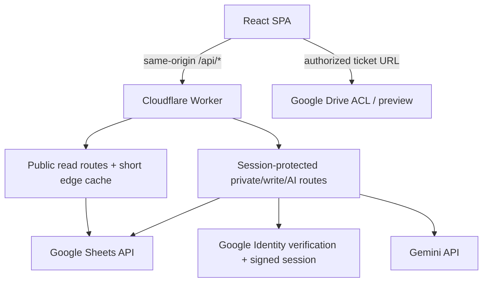

# Cloudflare Sheets API Migration

## Goal Capsule

- **Objective:** Move the honeymoon web app runtime from Google Apps Script hosting to one Cloudflare Worker that serves the React application and a Google Sheets API-backed server, while preserving every current user-facing capability.
- **Authority:** This plan captures the decisions settled in the conversation. The live Google Sheet and current `gas/Code.js` behavior remain the data and compatibility authorities during migration.
- **Execution profile:** Implement on a new feature branch. Keep `main` and its current GitHub Actions → GAS deployment unchanged until parity and access-control acceptance are complete.
- **Stop conditions:** Do not expose credentials or private URLs to the browser; do not let preview writes touch the production Sheet; do not cut production traffic away from GAS before Vic and Dora validate authentication, tickets, editing, and Drive access.
- **Tail ownership:** Present the completed branch diff and verification evidence for user review. Do not commit, push, open a PR, or switch production deployment without explicit approval.

---

## Product Contract

### Summary

Replace the GAS-hosted runtime with a faster, warning-free Cloudflare-hosted application. Anonymous visitors with the shared URL continue to use the existing read-only planning experience. Only Vic and Dora can sign in to see private ticket and source-Sheet links, edit Sheet-backed data, invoke AI features, and manage private chat history.

The migration preserves the existing GAS deployment as a rollback target and preserves push-triggered deployment. Feature-branch pushes deploy an isolated Cloudflare preview; production remains on GAS until acceptance, after which `main` becomes the Cloudflare production deployment trigger.

### Problem Frame

The current application is coupled to `google.script.run` and GAS hosting. This causes the Google Apps Script warning banner, ties the frontend transport to GAS, and prevents independent edge caching. A static host by itself is insufficient because the app writes private Sheet data and calls Gemini with secrets.

The existing frontend permission checks are only presentation controls. Ticket data is fetched before authorization and raw Sheet/Drive links are currently compiled into the public frontend. The replacement must establish a server-side security boundary rather than reproduce those leaks through a new API.

### Actors

- **Anonymous visitor:** Has the shared site URL and may view the currently public, read-only travel-planning views.
- **Authorized editor:** Vic or Dora, authenticated with an allowlisted Google account. Has anonymous capabilities plus private tickets/links, writes, AI, and chat history.
- **Authenticated but unauthorized user:** Has a valid Google identity but is not allowlisted. Remains in public mode and receives a clear authorization error.
- **Deployment operator:** Configures Cloudflare/Google secrets, validates preview, and explicitly approves cutover or rollback.

### Requirements

**Hosting and experience**

- **R1.** The React SPA and `/api/*` must be served from one Cloudflare Worker origin, with desktop/mobile behavior and direct-route SPA fallback preserved.
- **R2.** The Cloudflare UI must not show the Google Apps Script warning banner and must not depend on `google.script.run`.
- **R3.** Anonymous visitors must be able to load the currently public read-only dashboard, itinerary, todos, expense view, navigation, attraction content, food recommendations, and journey content without signing in.
- **R4.** Existing lazy tab loading, optimistic updates, responsive layout, and recoverable retry behavior must remain functional.

**Authentication and privacy**

- **R5.** Google Identity Services must authenticate Vic and Dora. The Worker must validate the Google credential and editor allowlist before creating an authenticated session.
- **R6.** Ticket metadata/counts/URLs, the raw Google Sheet link, ticket-folder link, chat history, AI actions, and every mutation must be protected by Worker-side authorization.
- **R7.** Anonymous or unauthorized requests to private/read-write routes must not receive private fields, even if they call the API directly or modify frontend state.
- **R8.** Sign-out, session expiry, and account switching must remove private UI, purge in-memory private data, and prevent pending private requests from updating the public session.

**Data and feature parity**

- **R9.** The new API client must preserve the component-facing request/response contracts of all current `gasClient` operations.
- **R10.** Reads and writes must preserve physical Sheet row numbers, display values, dates, line breaks, booleans, and rich-text hyperlinks used by the UI.
- **R11.** Itinerary edits, todo completion, expense create/edit/delete, attraction/food/journey generation, itinerary suggestions, AI secretary search/chat, and chat-history deletion/clear must retain current behavior.
- **R12.** AI generation and persistence outcomes must be distinguishable so generated content is not falsely reported as saved when a Sheet write fails.
- **R13.** Destructive or row-addressed mutations must validate the expected record identity and return a conflict instead of changing a shifted row.

**Performance and reliability**

- **R14.** Related Sheet reads must be batched and narrow; public read models may use bounded edge caching, while authenticated/private responses must never enter a shared cache.
- **R15.** Google `429` and transient `5xx` responses must use bounded exponential backoff and surface retryable API errors rather than appearing as empty data.
- **R16.** Successful writes and AI persistence must invalidate relevant cached public data before the next read.

**Deployment and rollback**

- **R17.** The feature branch must have an automatic Cloudflare preview deployment without changing the production GAS deployment.
- **R18.** Preview writes and AI persistence must be disabled by default unless a separate staging Sheet and preview secrets are configured.
- **R19.** After explicit parity approval, pushes to `main` must automatically deploy Cloudflare production.
- **R20.** The existing GAS deployment must remain available through a manual rollback workflow until post-cutover acceptance is complete.

### Key Product Decisions

- **Public read boundary — Governs R3, R6, R7.** Preserve the current public read-only tabs, including todos and expense planning. Make ticket metadata/URLs, raw Sheet/Drive links, chat/history, AI controls, and all writes editor-only. This interprets “目前 FE 已經有判斷在擋” as the current visible read experience while moving enforcement to the server.
- **Feature parity before replacement — Governs R9, R11, R17, R19, R20.** No current GAS capability is intentionally removed. GAS remains production and rollback until the Cloudflare version is validated.
- **Authorized editors — Governs R5, R6.** Vic and Dora use their own Google accounts. A shared password or public edit token is out of scope.

### Key Flows

1. **Anonymous read:** Open shared URL → Worker serves SPA → public endpoints return only public read models → private links/actions are absent.
2. **Authorized sign-in:** Google credential → Worker verifies signature/claims/allowlist → signed session cookie → frontend refreshes permission and privately fetches tickets.
3. **Unauthorized sign-in:** Valid Google credential but no allowlist match → no editor session → public mode remains usable with an explicit error.
4. **Authorized write:** UI submits expected row identity and update → Worker validates session/input/current Sheet row → writes through Sheets API → invalidates affected cache → returns updated result.
5. **AI and persistence:** Authorized request → Gemini response → Sheet persistence → response states whether content was persisted; generation remains visible with an unsaved state if persistence fails.
6. **Session loss:** Sign-out/expiry → frontend aborts private work and clears private state → public reads remain available.
7. **Rollout:** Feature branch preview → staging/read-only validation → Vic/Dora parity acceptance → approved workflow cutover → GAS retained for rollback.

### Acceptance Examples

- **AE1 (R3, R6, R7):** Given no session, when a visitor loads the site and directly calls `/api/tickets`, the public pages load but the ticket call returns an authorization error and no ticket metadata or URL.
- **AE2 (R5, R6):** Given Dora signs in with the configured account, when authentication completes, ticket and editing features appear and the Worker returns private data.
- **AE3 (R5, R7):** Given a valid non-allowlisted Google account, when it signs in, the app remains public and every private route stays inaccessible.
- **AE4 (R8):** Given an authorized user has loaded tickets, when the session is cleared, ticket state and private links disappear without a page reload.
- **AE5 (R10):** Given a Sheet cell with multiple linked text runs and line breaks, when the Worker reads it, the rendered HTML contains only escaped text, `<a>` and ` ` while preserving link boundaries.
- **AE6 (R13):** Given an expense row shifted after another deletion, when a stale client deletes using the old row number and expected identity, the Worker returns `409` and does not delete a different record.
- **AE7 (R12):** Given Gemini succeeds but the Sheet write fails, when an AI action completes, the generated content is returned as unsaved and the UI offers retry instead of claiming persistence.
- **AE8 (R17, R18):** Given a feature-branch push without staging Sheet secrets, when preview deploys, public reads work but mutation/AI endpoints reject with a preview read-only response.
- **AE9 (R19, R20):** Given parity approval and a `main` push after cutover, when Cloudflare deployment fails, the operator can restore the still-live GAS target using the documented rollback workflow.

### Success Criteria

- Anonymous, Vic, Dora, unauthorized, and expired-session authorization states pass direct API and browser checks.
- Every existing `gasClient` operation has a recorded Worker/API parity check.
- No credential, raw Sheet link, ticket-folder link, or ticket URL appears in the public JavaScript bundle or anonymous API responses.
- Public warm reads demonstrate fewer Google API calls than uncached reads; transient quota errors are retryable.
- Feature-branch deployment cannot alter production GAS or production Sheet data by default.

### Scope Boundaries

**In scope**

- Cloudflare Worker Static Assets hosting, typed HTTP API, Google login/session handling, Google Sheets REST integration, Gemini REST integration, frontend transport/auth changes, high-value automated tests, deployment workflows, and operational documentation.
- Small UI changes required for sign-in/out, permission errors, unsaved AI results, and retryable load errors.

**Deferred to follow-up work**

- Replacing Drive preview with a Worker download proxy; direct authenticated Drive links remain the first implementation.
- Migrating from Gemini `generateContent` to the newer Interactions API or changing model quality/cost policy. Models become environment-configurable during this migration.
- Advanced rate limiting, analytics, custom domain changes, and long-term removal of the GAS source.

**Outside this product’s identity**

- Public editing, anonymous AI access, offline write queues, multi-tenant trips, or a general user/role administration system.

### Dependencies and Deployment Inputs

- Cloudflare account, Worker name/domain, production/preview environments, and a Workers Builds Git connection with its Cloudflare-managed build token.
- Google OAuth web client ID plus authorized origins.
- Exact Google accounts for Vic and Dora.
- Target spreadsheet shared with the service-account email.
- Service-account email/private key, Gemini key, session-signing key, and Sheet ID configured as encrypted Worker secrets.
- A copied staging spreadsheet is required before preview write/AI end-to-end tests; until then preview remains read-only.

---

## Planning Contract

### Key Technical Decisions

- **KTD1. Single Worker deployment** *(session-settled: user-approved — chosen over GAS hosting and static-only GitHub Pages: it removes GAS chrome while keeping secrets and writes server-side; governs R1, R2, R17-R20).* Use Cloudflare Workers Static Assets with the Worker running first for `/api/*` and SPA fallback for application routes.
- **KTD2. Optional Google login with server session** *(session-settled: user-directed — chosen over protecting the entire site with Cloudflare Access: public read access must remain available; governs R3, R5-R8).* The browser obtains a GIS ID credential. The Worker validates Google claims and allowlisted verified email, then issues a short-lived HMAC-signed `HttpOnly; Secure; SameSite=Lax` cookie. State-changing requests also validate same-origin headers.
- **KTD3. Server-enforced visibility matrix** *(session-settled: user-directed — chosen over retaining frontend-only gating: ticket, Sheet and edit access are explicitly private; governs R3, R6-R8).* Route policy is centralized and tested. The frontend receives only the fields allowed for its authenticated state.
- **KTD4. Preserve the frontend service interface** *(governs R4, R9, R11).* Replace `google.script.run` inside the existing client abstraction with a typed `fetch` transport so feature components require minimal churn. Keep local mock behavior for ordinary Vite UI development.
- **KTD5. Service-account Sheets gateway with targeted grid reads** *(governs R9-R13).* Use a cached service-account OAuth token. Use batched values endpoints for ordinary cells and targeted `spreadsheets.get` field masks for `formattedValue`, `hyperlink`, and `textFormatRuns`. Never read the full workbook grid.
- **KTD6. Conflict-aware mutations** *(governs R11, R13).* Row-addressed writes carry expected identifying fields. The Worker rereads and compares them before update/delete and returns a standardized `409` on drift.
- **KTD7. Short public cache, no private shared cache** *(governs R14-R16).* Cache only explicitly public GET responses for a short TTL. Mutations invalidate relevant keys. Private/session responses use `Cache-Control: private, no-store`.
- **KTD8. Parallel deployment with safe preview defaults** *(session-settled: user-directed — chosen over an in-place GAS replacement: the user requested a new branch and preservation of automatic deployment; governs R17-R20).* Existing `.github/workflows/deploy.yml` remains untouched during branch validation. Cloudflare Workers Builds listens to the feature branch and uploads a preview without exposing a Cloudflare token to GitHub Actions. Preview is read-only unless staging bindings exist. Cutover is a later approved build-configuration change.

### High-Level Technical Design

### API and Error Contract

- Authentication: `GET /api/auth/config`, `GET /api/auth/session`, `POST /api/auth/google`, `DELETE /api/auth/session`.
- Public reads: itinerary, todos, expenses, navigation, attractions, food, and journey.
- Private reads: tickets and chat history.
- Private mutations: itinerary, todos, expenses, AI actions, chat, and chat-history management.
- Standard error body: `{ error: { code, message, retryable, requestId } }`.
- Status mapping: `400` validation, `401` no/expired session, `403` valid but unauthorized, `409` stale row, `429` Google quota, `502/503` Google/Gemini dependency failure.
- Logs contain request ID, route, duration, dependency status, and cache outcome only; never tokens, keys, raw Sheet payloads, ticket URLs, trip context, or chat content.

### Implementation Constraints

- Preserve unrelated local changes in `.codex/config.toml` and `.codex/skills/`.
- Keep `npm run build` as the GAS build until cutover; add distinct Cloudflare build/deploy scripts.
- Do not store the provided service-account JSON in the repository or copy its contents into examples.
- Do not test constants, display-name mappings, or styles. Add tests only for security boundaries, parsing, business behavior, integration contracts, and failure handling.
- Keep `gas/` and `.clasp.json` during parallel operation.

### Sequencing

1. Establish parity fixtures, route policy, shared types, and test/runtime tooling.
2. Implement Worker primitives: errors, secrets, Google service-account token, GIS verification/session, and Sheets gateway.
3. Implement public/private reads, then mutations and AI/chat parity.
4. Replace the frontend transport and add sign-in/session/private-state behavior.
5. Add the Cloudflare build and Workers Builds preview configuration without modifying production GAS.
6. Run automated and browser parity checks; only after user approval perform the separate production cutover.

### Risks and Mitigations

- **Rich-text loss or unsafe HTML:** Contract-test representative multi-run links and escaping; only generate escaped text, `<a>` and ` `.
- **Public data leakage:** Central route policies, direct anonymous API tests, bundle/source-map secret scan, and private cache prohibition.
- **Wrong-row writes:** Expected-record validation and `409` refresh flow.
- **Sheets quota:** Batched narrow reads, OAuth token reuse, short public caching, bounded backoff, and request-count tests.
- **Preview corrupts production:** Read-only preview default and separate staging bindings for write tests.
- **Drive access differs from site auth:** Test Drive ACL separately for both Vic and Dora on desktop and mobile.
- **AI succeeded but save failed:** Explicit `persisted` result and retryable persistence behavior.
- **OAuth configuration delay:** Implement configuration via environment; local automated tests use signed fixtures. End-to-end editor validation waits for real client/origin/account inputs.

### Research Basis

- [Cloudflare Workers Static Assets SPA routing](https://developers.cloudflare.com/workers/static-assets/routing/single-page-application/)
- [Cloudflare Workers Git integration](https://developers.cloudflare.com/workers/ci-cd/builds/git-integration/github-integration/)
- [Cloudflare Wrangler environments](https://developers.cloudflare.com/workers/wrangler/environments/)
- [Cloudflare secrets](https://developers.cloudflare.com/workers/configuration/secrets/)
- [Google Identity Services server-side token verification](https://developers.google.com/identity/gsi/web/guides/verify-google-id-token)
- [Google service-account OAuth flow](https://developers.google.com/identity/protocols/oauth2/service-account)
- [Google Sheets values and batch APIs](https://developers.google.com/workspace/sheets/api/guides/values)
- [Google Sheets usage limits](https://developers.google.com/workspace/sheets/api/limits)
- [Google Sheets CellData](https://developers.google.com/workspace/sheets/api/reference/rest/v4/spreadsheets/cells)
- [Google Drive sharing ACLs](https://developers.google.com/workspace/drive/api/guides/manage-sharing)
- [Gemini API-key security](https://ai.google.dev/gemini-api/docs/api-key)

---

## Implementation Units

### U1. Runtime contracts and high-value test harness

- **Goal:** Make existing GAS behavior and the privacy matrix executable as tests before replacing the transport.
- **Requirements:** R6-R13, R15.
- **Files:** `package.json`, `vitest.config.ts`, `src/types/index.ts`, `worker/contracts.ts`, `worker/policy.ts`, `worker/__tests__/`.
- **Approach:** Add a Worker-compatible Vitest setup, shared API/error types, route policy declarations, and representative Sheet/GAS fixtures. Characterize current response shapes and physical row-number semantics.
- **Test scenarios:** AE1, AE3, AE5, AE6; every operation is classified public/private/read/write/AI; malformed and dependency errors use the standard contract.
- **Verification:** `npm run type-check`; `npm test -- --run`.
- **Dependencies:** None.

### U2. Worker platform, Google authentication, and session security

- **Goal:** Serve the SPA/API skeleton and create a secure optional editor session.
- **Requirements:** R1, R2, R5-R8.
- **Files:** `wrangler.jsonc`, `worker/index.ts`, `worker/http.ts`, `worker/auth.ts`, `worker/googleIdentity.ts`, `worker/__tests__/auth.test.ts`, `.dev.vars.example`.
- **Approach:** Configure Worker Static Assets, same-origin routing, GIS credential validation using Google rotating keys, HMAC session cookies, allowlist checks, Origin validation, no-store private responses, and sanitized structured logging.
- **Test scenarios:** Anonymous session, Vic/Dora allowlisted login, valid unauthorized login, expired/wrong-audience token, tampered/expired cookie, logout, cross-origin mutation, and no secret/token logging.
- **Verification:** Auth test suite; local `wrangler dev` auth/session smoke with fixture bindings.
- **Dependencies:** U1.

### U3. Sheets gateway, rich-text conversion, batching, and cache

- **Goal:** Replace `SpreadsheetApp` with a quota-aware Sheets REST adapter without losing display semantics.
- **Requirements:** R9, R10, R13-R16.
- **Files:** `worker/googleServiceAccount.ts`, `worker/sheets.ts`, `worker/richText.ts`, `worker/cache.ts`, `worker/retry.ts`, corresponding tests and fixtures.
- **Approach:** Sign and cache service-account OAuth tokens with Web Crypto; add narrow batch read/write helpers; reconstruct safe rich text from targeted grid data; preserve physical row numbers; implement transient retry and explicit public-cache helpers.
- **Test scenarios:** Multi-run links, whole-cell hyperlinks, line breaks, HTML characters, missing cells, formatted dates/currency, boolean todos, physical row indexes, token reuse, 429 backoff limit, public cache hit/miss/invalidation, and private no-store behavior.
- **Verification:** Focused gateway/parser/cache tests plus Worker type-check.
- **Dependencies:** U1.

### U4. Read and mutation API parity

- **Goal:** Implement all non-AI data operations with server-side privacy and stale-row protection.
- **Requirements:** R3, R4, R6-R11, R13-R16.
- **Files:** `worker/routes/itinerary.ts`, `worker/routes/tickets.ts`, `worker/routes/todos.ts`, `worker/routes/expenses.ts`, `worker/routes/content.ts`, `worker/router.ts`, route tests.
- **Approach:** Port `gas/Code.js` read/write behavior into typed routes. Batch related public ranges where possible. Require editor sessions for tickets and all writes. Validate inputs and record identity before row mutations.
- **Test scenarios:** Public read parity for every visible tab; anonymous ticket denial; create/edit/delete expense; itinerary edit preserves protected columns; todo status update; stale-row `409`; dependency error mapping; cache invalidation after successful writes.
- **Verification:** Route integration tests using a fake Sheets transport and contract fixtures.
- **Dependencies:** U2, U3.

### U5. Gemini, persisted content, and secretary parity

- **Goal:** Preserve attraction, food, itinerary suggestion, journey, and chat features without exposing Gemini credentials.
- **Requirements:** R6, R9, R11, R12, R15, R16.
- **Files:** `worker/gemini.ts`, `worker/routes/ai.ts`, `worker/routes/chat.ts`, `worker/prompts.ts`, AI/chat tests.
- **Approach:** Port prompts and response parsing from `gas/Code.js`; keep model names configurable; require editor session; persist through the Sheets gateway; report generation and persistence separately; make journey replacement atomic from the caller’s perspective.
- **Test scenarios:** Auth denial, ordinary generation, search-grounded chat request, malformed Gemini output, Gemini `429/5xx`, successful persistence, persistence failure with `persisted: false`, chat history read/delete/clear, and journey write failure leaving previous content intact.
- **Verification:** AI/chat tests with recorded response fixtures and fake Sheets/Gemini transports; no live paid call required in CI.
- **Dependencies:** U2, U3, U4.

### U6. Frontend HTTP transport, sign-in, and private-state lifecycle

- **Goal:** Run the existing UI against the Worker while preserving component behavior and making privacy state explicit.
- **Requirements:** R2-R9, R11, R12.
- **Files:** `src/utils/gasClient.ts`, `src/utils/apiClient.ts`, `src/hooks/useAuth.ts`, `src/components/App.tsx`, affected ticket/menu/AI/error components, `src/config/trip.config.ts`, `index.html`.
- **Approach:** Keep the exported service method signatures but route production calls through same-origin `fetch`; retain local mocks. Load GIS from the official script, add sign-in/out states, gate private fetches before dispatch, move private URLs out of build-time config, abort/purge private state on session loss, and surface retry/conflict/unsaved outcomes.
- **Test scenarios:** AE1-AE4 and AE7; anonymous never prefetches tickets/history, sign-in reveals private features, unauthorized account stays public, logout clears state, failed tab load can retry, optimistic write rolls back or refreshes on `409`.
- **Verification:** Component/client tests where behavior-bearing seams exist; `npm run type-check`; desktop and mobile local-browser smoke against Worker dev.
- **Dependencies:** U2, U4, U5.

### U7. Cloudflare build, preview automation, and operations

- **Goal:** Preserve automatic deployment while keeping GAS safe until approved cutover.
- **Requirements:** R17-R20.
- **Files:** `vite.config.ts`, `scripts/`, `package.json`, `wrangler.jsonc`, `README.md`, `docs/deployment-cloudflare.md`.
- **Approach:** Add a distinct Cloudflare build that produces `dist/index.html` and Worker assets without changing the current GAS build. Use Cloudflare Workers Builds Git integration for feature-branch preview uploads, keeping the deployment token outside GitHub Actions and repository code. The preview environment remains read-only without staging bindings. Document setup, OAuth origins, Sheet sharing, staging verification, cutover, and rollback. Leave `.github/workflows/deploy.yml` unchanged in this branch.
- **Test scenarios:** AE8; build contains root `index.html`; SPA fallback and `/api/*` routing work; the preview deploy command uploads a version and never invokes clasp or production Worker deployment.
- **Verification:** `npm run build`; `npm run build:cloudflare`; artifact assertions; workflow/static configuration review.
- **Dependencies:** U2, U6.

### U8. End-to-end parity and cutover readiness

- **Goal:** Prove the branch is safe to review and identify only external deployment inputs that remain.
- **Requirements:** R1-R20.
- **Files:** `docs/cloudflare-parity-checklist.md`, browser smoke artifacts if retained.
- **Approach:** Run the API authorization matrix, GAS↔Worker operation matrix, bundle secret/private-URL scan, public cache/request-count checks, responsive browser flows, and staging mutation/AI checks when staging inputs are available. Record cutover blockers without modifying production.
- **Test scenarios:** AE1-AE9; anonymous/Vic/Dora/other/expired; desktop/mobile; Drive access for both editors; concurrent mutation conflict; Google/Gemini outage; preview read-only; rollback rehearsal.
- **Verification:** All commands in the Verification Contract and completed checklist evidence. Any real-environment item blocked by missing Cloudflare/OAuth/staging inputs is explicitly marked as a deployment dependency, not silently passed.
- **Dependencies:** U1-U7.

---

## Verification Contract

| Gate | Command or evidence | Applies to | Required result |
|---|---|---|---|
| Type safety | `npm run type-check` | U1-U7 | Exit 0 |
| High-value automated tests | `npm test -- --run` | U1-U6 | Exit 0; auth, policy, parsing, mutations, AI persistence and client behavior covered |
| Legacy GAS build | `npm run build` | U7 | Exit 0; current GAS artifact remains buildable |
| Cloudflare build | `npm run build:cloudflare` | U2, U6, U7 | Exit 0; `dist/index.html` exists |
| Secret/private URL scan | Search built assets for service-account material, Gemini key patterns, raw Sheet/folder URLs and fixture tokens | U2, U6-U8 | No sensitive match |
| API authorization matrix | Direct requests as anonymous, Vic, Dora, unauthorized, expired/tampered session | U2, U4-U6, U8 | Exact public/private policy and status codes |
| Browser smoke | Local Worker dev, desktop and mobile widths | U6, U8 | Public browsing, sign-in state, private gating, retries and logout behave correctly |
| Staging integration | Real staging Sheet + OAuth + Drive/Gemini checks when inputs are configured | U3-U8 | Reads/writes/AI/Drive verified without touching production |
| Deployment isolation | Inspect/run Workers Builds preview | U7-U8 | Feature branch uploads a preview version only; GAS production workflow unchanged |

Required verification evidence must include the actual command output. Tests are not required for constants, mappings, or pure styles; those changes use type-check/build/browser verification.

---

## Definition of Done

### Global

- The Cloudflare branch implements R1-R20 without changing production traffic or committing secrets.
- All 22 current component-facing service operations have an explicit parity implementation and verification result.
- Worker authorization, not frontend state, protects every private route and field.
- Public assets and anonymous responses contain no ticket URL, Sheet/folder URL, chat data, credential, or API key.
- Rich-text/date/row semantics and conflict-safe mutations have automated evidence.
- Both the GAS and Cloudflare builds pass.
- Preview defaults to read-only unless staging secrets are deliberately configured.
- The existing `main` GAS workflow remains unchanged in this implementation branch.
- Real-environment checks that require user-owned Cloudflare/OAuth/staging inputs are clearly listed for handoff; none are falsely reported as passed.
- Abandoned prototypes, duplicate transports, debug logging, and experimental code are removed from the final diff.
- The diff is summarized and presented for user approval without commit or push.

### Per Unit

| Unit | Done signal |
|---|---|
| U1 | Shared contracts, route policy and focused test harness are executable. |
| U2 | Worker serves SPA/API and auth/session tests cover allowed, denied, expired and tampered states. |
| U3 | Sheets gateway preserves rich text/rows, batches calls, retries transients and enforces cache policy. |
| U4 | Every non-AI read/write route matches policy and current behavior, including stale-row rejection. |
| U5 | Every AI/chat operation is private, Gemini-compatible and reports persistence truthfully. |
| U6 | Frontend uses HTTP in Cloudflare mode, does not prefetch private data, and clears it on session loss. |
| U7 | Separate Cloudflare build/preview automation and deployment/rollback documentation exist; GAS workflow is untouched. |
| U8 | Automated/local acceptance is complete and remaining real-environment dependencies are explicit. |
