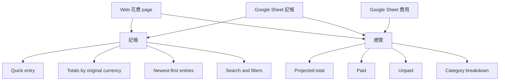
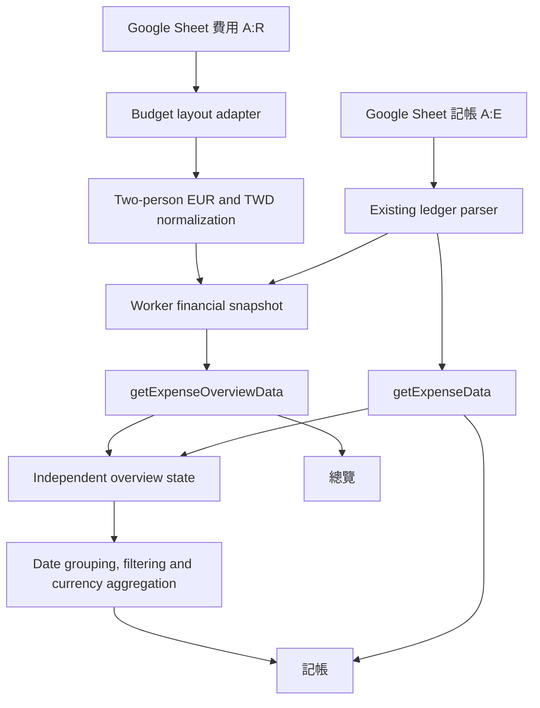

# Honeymoon Expense Dashboard - Plan

## Goal Capsule

- **Objective:** Extend the Web `花費` page so it remains fast for expense entry and recent-history review while also showing the trip's projected total, paid amount, and unpaid amount.
- **Product authority:** The live Google Sheet remains the source of truth. `費用` owns planned and fixed trip costs; `記帳` owns additional expenses recorded during the trip.
- **Implementation authority:** Product Contract decisions take precedence over Planning Contract choices. Existing repository and UI conventions take precedence where the plan is silent.
- **Open blockers:** None.
- **Stop conditions:** Stop if the live `費用` layout no longer exposes the agreed category amounts and `已付款` cells, or if implementation would require mutating `費用` from the Web.
- **Execution profile:** Code changes with parser proof, frontend calculation proof, type checking, the full test suite, a production build, and responsive browser verification.
- **Tail ownership:** Complete code review, commit, push, and pull-request creation in this run.

---

## Product Contract

### Summary

The Web `花費` page will provide two sub-tabs: `記帳` and `總覽`.
`記帳` remains the default experience and combines quick entry with the complete, newest-first ledger and its filters. `總覽` exposes the Google Sheet expense plan.

### Problem Frame

The current Web page supports entering and reviewing `記帳` records but does not expose the trip-wide cost plan from `費用`.
During the trip, `費用` amounts will be updated from estimates to known or paid amounts, while `記帳` will continue accumulating meals and other additional spending.
The user needs both sources combined into a clear two-person financial picture without maintaining a second set of values in the Web app.

### Key Decisions

- **Keep one current amount per `費用` item** (session-settled: user-directed — chosen over separate estimated and actual amount fields: the Sheet should hold the best-known amount at that moment). Governs R1.
- **Use `已付款` as the payment boundary** (session-settled: user-directed — chosen over an amount-confirmed field: payment state alone should determine paid versus unpaid totals). Governs R2, R5, R6.
- **Add every `記帳` entry on top of `費用`** (session-settled: user-directed — chosen over consuming or replacing category budgets: direct addition is easier to understand). Governs R3, R4, R5.
- **Show two-person totals only** (session-settled: user-directed — chosen over per-person and two-person switching: all entered and displayed amounts represent the couple). Governs R3-R7.
- **Split `花費` into two sub-tabs** (session-settled: user-directed — simplified from the earlier three-tab design after confirming that the newest-first ledger already makes a separate today view unnecessary). Governs R8-R12.
- **Use current-rate TWD equivalents for the overall view** (session-settled: user-approved — chosen over currency-separated overall totals: one comparable headline is more useful even though it is not the final card settlement). Governs R3-R7.

### Requirements

**Expense sources and calculations**

- R1. The Web view must treat each `費用` amount as the current best-known two-person amount, whether it is still estimated or has already been updated to the final amount.
- R2. Each `費用` item must be classified as paid or unpaid solely from its `已付款` state.
- R3. `目前預計總花費` must equal the two-person `費用` total plus all `記帳` amounts after conversion to current-rate TWD equivalents.
- R4. Every `記帳` amount must be additive and must not consume, replace, or reconcile against an existing `費用` category budget.
- R5. `已實際支出` must equal paid `費用` amounts plus all `記帳` amounts after conversion to current-rate TWD equivalents.
- R6. `剩餘待付款` must equal the unpaid `費用` amounts.
- R7. The overall view must present headline amounts in TWD and retain original currencies in item-level details.

**Page structure**

- R8. The `花費` page must contain `記帳` and `總覽` sub-tabs and open on `記帳` by default.
- R9. `記帳` must contain one quick-entry surface followed by the newest expense records and totals grouped by original currency.
- R10. `總覽` must show `目前預計總花費`, `已實際支出`, `剩餘待付款`, and the major `費用` category breakdowns.
- R11. `記帳` must show all records and preserve expense search, date grouping, category filtering, and currency filtering.
- R12. Existing editing and deletion behavior must remain available from `記帳`.

**Refresh behavior**

- R13. After a new expense is saved, the visible currency totals and newest ledger entries must refresh to include it.
- R14. When a `費用` amount or `已付款` state changes in Google Sheets, the next Web data refresh must recompute the overview from the updated values.

### Key Flows

- F1. Daily expense entry
  - **Trigger:** The user opens `花費`.
  - **Steps:** `記帳` opens by default; the user enters an item, amount, currency, and category; the entry is saved; the newest records and currency totals refresh.
  - **Covered by:** R8, R9, R13.
- F2. Trip cost review
  - **Trigger:** The user switches to `總覽`.
  - **Steps:** The page combines the latest `費用` values and `記帳` totals; it shows projected, paid, unpaid, and category figures in the agreed currency presentation.
  - **Covered by:** R1-R7, R10, R14.
- F3. Historical expense review
  - **Trigger:** The user reviews the lower section of `記帳`.
  - **Steps:** The newest records appear first; the user searches or filters the full ledger and can use the existing edit or delete actions.
  - **Covered by:** R11, R12.

### Acceptance Examples

- AE1. **Covers R9, R13.** Given the ledger contains recent `EUR 68`, `EUR 9`, and `CHF 18.5` entries, when the user opens `記帳`, then the newest records are visible and the overview shows `EUR 77` and `CHF 18.5` as separate totals.
- AE2. **Covers R3-R6.** Given `費用` totals TWD 500,000, paid `費用` totals TWD 300,000, and converted `記帳` totals TWD 20,000, when the user opens `總覽`, then projected is TWD 520,000, paid is TWD 320,000, and unpaid is TWD 200,000.
- AE3. **Covers R1, R6, R14.** Given an unpaid hotel amount changes in `費用` from TWD 50,000 to TWD 55,000, when Web data refreshes, then projected and unpaid each increase by TWD 5,000 while paid is unchanged.
- AE4. **Covers R2, R5, R6, R14.** Given a TWD 10,000 `費用` item changes from unpaid to paid without changing its amount, when Web data refreshes, then paid increases by TWD 10,000, unpaid decreases by TWD 10,000, and projected is unchanged.
- AE5. **Covers R11, R12.** Given records exist across multiple dates, currencies, and categories, when the user filters `記帳`, then only matching entries appear and their existing edit and delete actions remain available.

### Scope Boundaries

- `費用` remains view-only in the Web experience; amount and payment-state updates continue in Google Sheets.
- V1 does not add separate estimated and actual amount fields.
- V1 does not add an amount-confirmed field.
- V1 does not automatically match, consume, or reconcile `記帳` entries against `費用` budgets.
- V1 does not add per-person totals or a one-person/two-person toggle.
- V1 does not attempt to reproduce final credit-card settlement amounts when only an original-currency amount is available.
- Authentication and authorization behavior remain unchanged.

### Dependencies and Assumptions

- The live Google Sheet remains available and keeps `費用` and `記帳` as the authoritative tabs.
- The overall TWD figures use a consistent current exchange-rate basis; original currencies remain visible where exact paid currency matters.

### Sources and Research

- `AGENTS.md` — live Google Sheet authority and project data rules.
- `src/components/ExpensePage.tsx` — existing quick entry, ledger presentation, filtering, editing, and deletion behavior.
- `shared/apiTypes.ts` — existing ledger fields required for per-day, per-currency totals.
- `shared/apiOperations.ts` — existing ledger read and mutation operations.
- `worker/tripRepository.ts` — current `記帳` access and the absence of a `費用` read path.
- Live `費用!A3:R42` and formulas — current summary, accommodation, transport, dining, ticket, exchange-rate, and `已付款` ranges.
- `worker/__tests__/tripRepository.test.ts` — existing grid-parser coverage and numeric-cell conventions.

**Product Contract preservation:** Updated only for the user-directed two-tab simplification; the fee calculation and payment contracts remain unchanged.

---

## Planning Contract

### Key Technical Decisions

- KTD1. **Add a self-contained public overview read.** Introduce `getExpenseOverviewData` beside the unchanged `getExpenseData` operation. The Worker reads both `費用` and `記帳` and returns one authoritative financial snapshot, so React never combines independently cached totals. This implements R3-R7 and R10 without changing the ledger CRUD contract.
- KTD2. **Normalize `費用` inside a validated Worker adapter.** Centralize section anchors, coordinates, category mappings, unit multipliers, and payment columns. Accommodation detail is already two-person; transport, dining, tickets, and summary-only categories are normalized from one-person values. Required anchor drift fails visibly instead of producing plausible zeroes. This instantiates the two-person Product Contract decision for R1-R7.
- KTD3. **Only explicit `TRUE` is paid.** A detail row contributes to paid totals only when its `已付款` value is true. A blank or missing state remains in projected and unpaid with a warning, which preserves the current summary-only visa amount without inventing a paid state. This formalizes R2 conservatively until the Sheet supplies a checkbox.
- KTD4. **Make financial quality explicit.** The overview response carries `fetchedAt`, TWD-per-unit rates, normalized categories, budget and ledger components, combined totals, warnings, unconverted currencies, and completeness. Missing or invalid rates never disappear silently: the UI labels combined totals as known-currency subtotals while keeping original amounts visible. This implements R3-R7 without adding another rate source.
- KTD5. **Keep ledger and presentation logic pure.** Extract date grouping, currency totals, filtering, and overview-label selection into pure frontend helpers. The React page composes these helpers into `記帳` and `總覽`, preserving existing edit and delete components. This implements R8-R14 and keeps expensive transforms memoized.

### High-Level Technical Design

### Data Normalization

- `費用!C4:C13` remains the category-level one-person EUR authority; categories with the same label are aggregated and doubled for couple totals.
- Accommodation paid amounts use `費用!M4:M12` as two-person EUR values.
- Transport paid amounts use `費用!G17:G40`, dining uses `費用!M17:M19`, and tickets use `費用!Q4:Q30`; these one-person values are doubled.
- A detail row contributes to paid totals only when the adjacent checkbox has an effective boolean `true` or formatted `TRUE`; blank or missing states remain unpaid and emit a warning.
- The EUR-to-TWD rate comes from the live rate table. TWD itself has rate `1`; CHF and GBP rates are returned for `記帳` conversion.
- Paid category totals must not exceed category projected totals beyond the defined rounding tolerance. A violation marks the overview incomplete and suppresses authoritative headline wording instead of hiding the inconsistency.
- The Worker keeps full-precision arithmetic, rounds response money to two decimal places, and verifies that projected reconciles with paid plus unpaid within one TWD cent.

### Assumptions

- The current `費用` table blocks and their anchors remain stable for this version; the adapter rejects incompatible layout drift.
- A missing or invalid exchange rate does not block ledger display. It makes combined TWD values incomplete and exposes each affected currency to the UI.
- The 45-second public read cache remains acceptable for direct Sheet edits. The UI shows the financial snapshot time and states that Sheet changes may take up to 45 seconds to appear.
- Registering the overview as `public:read` intentionally exposes trip budget and payment totals to the same readers who can already view the public expense ledger; no Sheet URL or editor metadata enters the payload.

### System-Wide Impact

- **API contracts:** `getExpenseData` and all mutation payloads remain stable. The new response is additive and typed end to end.
- **Caching:** The overview is one cached snapshot of both Sheet sources. Successful expense mutations invalidate both ledger and overview cache entries through the existing public-operation invalidation loop.
- **Failure isolation:** Ledger and overview reads settle independently in React. Overview failure does not block quick entry or history; ledger failure does not turn the overview into zero.
- **Data integrity:** Required layout anchors, positive finite rates, recognized categories, finite amounts, and reconciliation invariants are validated before authoritative totals are exposed.
- **Authorization:** Anonymous and read-only users may read the overview but cannot save, edit, or delete; direct mutation requests retain existing authorization enforcement.
- **Time behavior:** Ledger date grouping uses the viewer device's local calendar and data refreshes on page re-entry and window focus.

### Risks and Mitigations

- **Sheet layout drift:** Validate headers and section anchors, return an explicit unavailable state, and cover truncated or shifted fixtures.
- **Incomplete currency conversion:** Preserve original amounts, report affected currency codes once, and label TWD figures as incomplete.
- **Stale direct Sheet edits:** Expose `fetchedAt` and the 45-second cache window rather than claiming a forced refresh.
- **Out-of-order requests:** Use a request generation guard so a slower prior read cannot overwrite a mutation refresh.
- **Mutation succeeds but refresh fails:** Preserve the locally known mutation result and show a refresh warning; never invite duplicate submission by reporting the mutation itself as failed.
- **Public financial disclosure:** Keep the response limited to amounts, categories, payment state, quality metadata, and rates already required by the public experience.

### Scope and Sequencing

1. Establish shared response types and prove the Worker parser against the current Sheet layout.
2. Expose the overview through the existing RPC, service, repository, and client layers.
3. Prove pure frontend calculations for local-day, filtering, and financial-quality presentation.
4. Recompose `ExpensePage` into the two user tasks while preserving ledger mutations.
5. Update the Sheet schema documentation and run end-to-end verification.

---

## Implementation Units

### U1. Parse and normalize the fee plan

- **Goal:** Convert the current `費用` grid into stable two-person category totals, paid totals, unpaid totals, and exchange rates.
- **Requirements:** R1-R7, R10, R14; F2; AE2-AE4.
- **Dependencies:** None.
- **Files:** `shared/apiTypes.ts`, `worker/models.ts`, `worker/tripRepository.ts`, `worker/__tests__/tripRepository.test.ts`.
- **Approach:**
  1. Add shared overview and category response types.
  2. Add `費用` to the repository sheet-name map.
  3. Implement a bounded layout adapter that validates live headers and uses grid effective values so formatted currency text never drives arithmetic.
  4. Normalize category and paid detail values per KTD2-KTD4.
- **Execution note:** Start with failing parser tests built from a compact grid fixture that mirrors the live ranges.
- **Patterns to follow:** `parseExpensesGrid`, `cellDisplayValue`, and `effectiveValue.numberValue` in `worker/tripRepository.ts`.
- **Test scenarios:**
  - Covers AE2. Given category totals and paid detail rows across all four blocks, parsing returns two-person projected, paid, and unpaid totals in TWD.
  - Covers AE3. Given an unpaid accommodation amount increases, projected and unpaid increase while paid is unchanged.
  - Covers AE4. Given an item changes from unpaid to paid without an amount change, paid and unpaid move by the same amount while projected is unchanged.
  - Given a summary-only visa amount has no detail payment checkbox, it remains in projected and unpaid totals and emits one warning.
  - Given formatted currency strings disagree with effective numeric values, calculations use effective numbers.
  - Given a required header, category anchor, or rate row is missing, parsing fails visibly instead of returning zero totals.
  - Given a rate is blank, zero, negative, or non-finite, the overview is incomplete and identifies the affected currency.
  - Given a paid detail subtotal exceeds its category total beyond tolerance, reconciliation fails visibly instead of capping the amount.
- **Verification:** Parser results reconcile projected as paid plus unpaid and preserve each category's original EUR total.

### U2. Expose the overview through the RPC stack

- **Goal:** Return one Worker-owned snapshot that combines normalized `費用` and converted `記帳` totals without changing existing ledger or mutation contracts.
- **Requirements:** R3-R7, R10, R14.
- **Dependencies:** U1.
- **Files:** `shared/apiOperations.ts`, `worker/tripService.ts`, `worker/index.ts`, `src/utils/tripClient.ts`, `worker/__tests__/tripService.test.ts`, `worker/__tests__/index.test.ts`.
- **Approach:** Add `getExpenseOverviewData` as a public read, combine repository budget and ledger data with one rate basis, delegate through `TripService`, route it through the Worker operation switch, and type the client method with the shared response.
- **Patterns to follow:** Existing `getExpenseData` public-read route and service delegation.
- **Test scenarios:**
  - A public GET for the overview is dispatched to the repository-backed service without editor authorization.
  - Existing `getExpenseData`, save, edit, and delete contracts remain unchanged.
  - A private expense mutation continues to invalidate the public overview cache.
  - The response contains no private Sheet link, editor identity, or unrelated tab data.
- **Verification:** The new operation is type-safe across shared, Worker, and frontend layers and follows the existing public-cache policy.

### U3. Add expense calculation helpers

- **Goal:** Derive per-currency totals, filtered and date-grouped history, and presentation state from API data.
- **Requirements:** R3-R7, R9-R11, R13-R14; F1-F3; AE1-AE5.
- **Dependencies:** U1.
- **Files:** `src/components/expenseData.ts`, `src/components/expenseData.test.ts`.
- **Approach:** Add pure functions for device-local date grouping, currency aggregation, filtered history, and overview presentation labels. Combined financial arithmetic remains Worker-owned per KTD1.
- **Execution note:** Implement the pure behaviors test-first before wiring them into React.
- **Patterns to follow:** Existing `useMemo` calculations in `src/components/ExpensePage.tsx` and Vitest data-helper tests under `src/components/`.
- **Test scenarios:**
  - Covers AE1. EUR and CHF entries aggregate separately and remain newest-first in the ledger.
  - Covers AE2. A complete overview response presents projected, paid, and unpaid without recomputing them.
  - Search, category, and currency filters combine conjunctively and preserve row identity.
  - An incomplete overview reports unconverted currencies and uses known-currency subtotal wording.
  - Local timestamps group under the viewer's calendar date.
  - Invalid timestamps remain available under the fallback history group.
- **Verification:** Pure helper outputs match all acceptance examples without relying on component state or browser rendering.

### U4. Recompose the expense page into two tabs

- **Goal:** Deliver the `記帳` and `總覽` experiences while preserving quick entry and existing ledger mutations.
- **Requirements:** R7-R14; F1-F3; AE1-AE5.
- **Dependencies:** U2, U3.
- **Files:** `src/components/ExpensePage.tsx`, `src/components/ExpenseItem.tsx`, `src/components/expenseData.ts`, `src/components/expenseData.test.ts`.
- **Approach:**
  1. Load ledger and overview concurrently but settle their loading and error states independently.
  2. Keep one quick-entry form on the default `記帳` tab.
  3. Show the newest entries, original-currency totals, and filters below the form.
  4. Show TWD projected, paid, and unpaid cards plus category breakdowns on `總覽`.
  5. Preserve the existing search, filters, grouped history, edit, and delete controls in `記帳`.
  6. Refresh visible derived data after save, edit, delete, tab re-entry, and window focus.
  7. Preserve the last successful snapshot during refresh failures and prevent stale requests from overwriting newer results.
- **Patterns to follow:** Existing Tailwind card, typography, loading, and `ExpenseItem` interaction patterns.
- **Test scenarios:**
  - `記帳` is selected on first render and has no duplicate entry form.
  - Saving an expense updates the newest visible details and per-currency totals.
  - `總覽` distinguishes projected, paid, and unpaid and identifies unconverted ledger currencies.
  - `記帳` preserves search, category, currency, expand, edit, and delete behavior.
  - Ledger success with overview failure leaves `記帳` usable and shows `總覽` as unavailable rather than zero.
  - Overview success with ledger failure keeps the overview snapshot visible and marks history unavailable.
  - A successful mutation followed by refresh failure remains successful and shows a refresh warning.
  - A failed delete restores the prior row and every derived ledger total.
  - A slow earlier request cannot overwrite a later mutation refresh.
  - Read-only users can inspect both tabs but cannot invoke mutation controls.
  - Empty, loading, read-only, and fetch-failure states remain understandable on mobile and desktop.
- **Verification:** Browser inspection at mobile and desktop widths confirms the two tasks are distinct, controls do not overflow, and mutations still work for an editor.

### U5. Document the live expense-sheet contract

- **Goal:** Record the `費用` read dependency so future Sheet changes do not silently break the overview.
- **Requirements:** R1, R2, R14.
- **Dependencies:** U1, U2.
- **Files:** `README.md`, `SETUP.md`.
- **Approach:** Document the `費用` tab's four detail blocks, payment columns, rate table, two-person normalization, and read-only Web ownership.
- **Test expectation:** none — documentation only.
- **Verification:** Documentation distinguishes `費用` planning data from `記帳` ledger data and does not expose credentials.

---

## Verification Contract

| Gate | Scope | Done signal |
|---|---|---|
| Focused parser tests | U1 | Budget normalization, paid/unpaid classification, summary remainder, and numeric-cell behavior pass. |
| Focused frontend helper tests | U3, U4 | Date grouping, currency aggregation, filtering, and financial-quality presentation pass. |
| Full test suite | U1-U5 | `npm test -- --run` exits successfully. |
| Type safety | U1-U5 | `npm run type-check` exits successfully for frontend and Worker. |
| Production build | U1-U5 | `npm run build` emits production assets successfully. |
| Browser behavior | U4 | Local Cloudflare-backed app passes mobile and desktop review for both expense tabs. |
| Live data smoke check | U1-U4 | The overview matches the current `費用` totals and payment states within the Sheet's current-rate conversion basis. |
| Degraded-state behavior | U1-U4 | No parse, rate, or read failure renders an authoritative zero; incomplete or stale values are labeled and retryable. |
| Cache behavior | U2, U4 | The displayed snapshot time and up-to-45-second Sheet refresh window match the Worker cache behavior. |
| Independent review | U1-U5 | Code review has no unresolved actionable correctness, security, or maintainability finding. |

---

## Definition of Done

- The Web `花費` page opens on `記帳` and exposes `總覽` as the second sub-tab.
- Quick entry, edit, and delete still operate on `記帳`, and visible records and totals refresh after mutations.
- Overview figures use the latest available `費用` amounts and `已付款` states plus additive `記帳` TWD equivalents.
- Projected equals paid plus unpaid, with every `記帳` entry included in projected and paid.
- Category totals are two-person values and retain their original EUR amounts beside TWD equivalents.
- Missing payment detail remains visible as unpaid instead of being dropped.
- No parser, rate, or source failure is presented as an authoritative zero or complete total.
- The overview exposes snapshot time, conversion completeness, and any affected currency codes.
- Direct Sheet edits are documented and displayed with an up-to-45-second cache delay.
- Ledger date grouping uses the viewer's local calendar and refreshes after focus.
- Anonymous and read-only viewers receive only the intended financial read payload and cannot mutate it.
- All Verification Contract gates pass with recorded output.
- The final diff contains no abandoned experimental code or unrelated workspace changes.
- The branch is reviewed, committed, pushed, and opened as a pull request.
